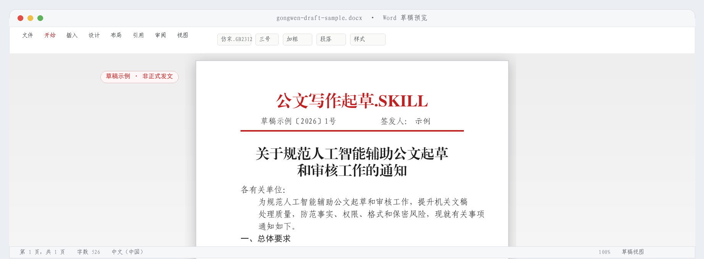

# gongwen-draft

gongwen-draft 是一个中文公文与政务材料写作 Agent skill，用于起草、改写、审核、政策核验和 Word 草稿导出。

本项目的目标是在事实、文种、权限、格式、字体、标点、政策引用和输出流程上尽量减少常见风险。核心工作方式是：**先查、先核、再写**。

## 快速使用

安装：将本仓库安装到支持自定义 skill 的 Agent 工具中，刷新技能列表后，在对话里说”使用 gongwen-draft”即可。

**示例 1：起草通知**

请帮我把下面的会议要点整理成一份通知初稿。

会议主题：部署夏季防汛工作

会议决定：各街道6月30日前完成排水管网排查；水利局7月10日前修订防汛预案；应急管理局落实24小时值班

发文机关：XX区人民政府办公室

主送机关：各街道办事处、区直有关部门

**示例 2：审核请示**

请帮我审核这份请示的文种、标点、行文关系和政策引用有没有问题，再给一版改写稿。

[粘贴草稿]

**示例 3：导出 Word**

请把这份定稿导出为 Word 文件，按公文格式排版。

[粘贴定稿]

## 支持范围

gongwen-draft 支持 23 种公文与政务材料写作样式：15 种法定公文文种，另含调研报告等 8 类常见机关材料。

**法定公文（15 种，完整支持）**

覆盖《党政机关公文处理工作条例》规定的全部法定文种：决议、决定、命令（令）、公报、公告、通告、意见、通知、通报、报告、请示、批复、议案、函、纪要。

**扩展政务材料（8 类常见机关材料）**

支持工作总结、工作方案、调研报告、讲话稿、汇报材料、简报、情况专报、回复函。

## 能做什么

- 起草和改写：把会议记录、工作要点、调研材料整理成规范初稿。
- 政策研究：优先检索中国政府网、国务院部门官网、国家法律法规数据库、地方政府官网等权威来源。
- 引用核验：区分政策原文、官方解读、领导讲话、会议通稿、权威媒体背景材料和普通转载材料。
- 审核纠错：检查文种、行文关系、权限边界、事实、结构、标点、层级序号、附件说明和涉密风险。
- 语言润色：压缩空泛表达，降低夸大口吻，保留原有事实和单位口径。
- Word 导出：按公文习惯排版，并在导出前检查字体，不静默替换。

## 相比同类项目的优势

| 能力 | gongwen-draft 的做法 |
| --- | --- |
| 政策先行 | 新增 policy-research 工作流：先形成政策台账，再进入起草。 |
| 引用校验 | 新增 citation checker，拦截非官方来源、媒体替代政策原文、缺少机关或日期的引用。 |
| 文种覆盖 | 支持 23 种公文与政务材料写作样式，覆盖 15 种法定公文文种和 8 类常见机关材料。 |
| 素材进入 | 对多份材料先整理来源、事实、判断、待核实事项和起草风险。 |
| 格式与字体 | 支持 Word 草稿导出、格式审核和精确字体校验，缺少字体时停止导出。 |
| 可验证性 | 通过脚本和 CI 检查文种覆盖、语言风险、政策引用、字体资产和导出流程。 |

## 政策引用规则

正文政策依据优先来自 [中国政府网](https://www.gov.cn/)、[国家法律法规数据库](https://flk.npc.gov.cn/)、国务院部门官网、地方政府官网和其他官方公开发布平台。

人民日报、新华社、央视、半月谈等权威媒体可以作为背景材料或线索；写入正式依据前，应尽量回到官方原文核验。

找不到官方来源的政策、领导讲话、会议精神、统计数据和强制性要求，应标为“待核实”，不能写成确定依据。

## Word 与字体配置

默认字体配置：

| 用途 | 默认字体 |
| --- | --- |
| 发文机关标志、标题 | 方正小标宋简体 |
| 正文、三级和四级标题 | 仿宋\_GB2312 |
| 一级标题 | 黑体 |
| 二级标题、签发人姓名 | 楷体\_GB2312 |
| 页码 | 宋体 |

导出前会检查本机字体。缺少字体时，gongwen-draft 会停止导出并提示补齐；如果项目随附字体资产且用户具备使用授权，可按项目规则安装到当前 Windows 用户环境。

Word 文件通常只记录字体名称，不一定嵌入字体文件。跨设备使用时，对方电脑也需要安装相同字体。

## 使用红线

- 不伪造、冒用或模拟真实机关的正式发文，包括机关名称、发文字号、签发人、印章和审批意见。
- 不编造政策依据、统计数据、会议结论、领导讲话或审批状态。
- 不把转载文章、培训材料、社区项目或搜索摘要当作制度依据。
- 涉密、个人敏感、处分、人事、财政资金、行政处罚等材料应先脱敏，并按单位流程审核。
- 生成内容只是草稿，正式发文前仍需完成审核、会签、签发和保密审查。

## 推荐搭配的 Agent 工具

[QoderWork CN / Qoder CN](https://www.aliyun.com/product/lingma)：适合中文办公、材料整理和写作工作流。

[ZCode](https://zcode.z.ai/)：适合技能维护、长任务和深度调整。

[WorkBuddy](https://www.codebuddy.cn/work/)：适合办公场景、多任务执行和交付型工作。

## 参考来源

本项目优先参考 GB/T 9704-2012《党政机关公文格式》、GB/T 15834-2011《标点符号用法》、《党政机关公文处理工作条例》以及用户提供的单位模板和现行制度文件。

社区项目仅作为工程设计和使用体验参考；当其内容与官方标准、当前政策或用户单位模板不一致时，应以后者为准。

### 参考的社区项目

| 参考项目 | 借鉴重点 |
| --- | --- |
| [zhaohui-yang/official-document-drafting](https://github.com/zhaohui-yang/official-document-drafting) | 工程化纪律、文种路由、来源材料工作流、样例、测试、Word 导出和输出约定。 |
| [wzbwan/gongwen-format-skill](https://github.com/wzbwan/gongwen-format-skill) | 确定性排版思路，强调受控输入到 Word 文件生成。 |
| [KaguraNanaga/official-document-writing-skill](https://github.com/KaguraNanaga/official-document-writing-skill) | 模板、质量清单和实用审稿流程。 |
| [Aether-liusiqi/wenshu](https://github.com/Aether-liusiqi/wenshu) | 文种覆盖、结构检查、语言禁忌和常见事务文书组织方式。 |
| [luan-78-zao/official-document-writer-skill](https://github.com/luan-78-zao/official-document-writer-skill) | 起草请示、报告前进行政策来源检索的思路；同时提醒标准年份必须核验。 |
| [HenryLau7/gongwen-writing](https://github.com/HenryLau7/gongwen-writing) | 从文本、Word、PDF 等输入中识别文种并进入起草或导出的流程。 |
| [sunnydayplease668/gongwen-writing](https://github.com/sunnydayplease668/gongwen-writing) | 目的、对象、事实、结构、语气五个写作锚点。 |
| [farmer-data/gongwen-writing](https://github.com/farmer-data/gongwen-writing) | 文种、行文方向、格式、语言口径的四步定位法。 |
| [wocessade/gongwen-writing-skill](https://github.com/wocessade/gongwen-writing-skill) | 文种确认、规划、起草、审查、修订的分阶段流程。 |
| [Right-068/gongwen-writing-suite](https://github.com/Right-068/gongwen-writing-suite) | 事实台账、边界确认、多轮复核和敏感材料处理意识。 |
| [Likenttt/gongwen-writing-formatting](https://github.com/Likenttt/gongwen-writing-formatting) | 先明确交付物，再用结构化规格生成正式文件的流程。 |
| [gzfutureai/mcp-server-moke-gongwen](https://github.com/gzfutureai/mcp-server-moke-gongwen) | 模板、合规校验、上下文需求分析和风格优化的 MCP 化思路。 |
| [liaoxuyean/official-document-writer](https://github.com/liaoxuyean/official-document-writer) | 简洁命令式体验、文种速查、格式要素和常见错误提示。 |
| [hehecat/gongwen](https://github.com/hehecat/gongwen) | A4 预览、分页、解析和 DOCX 导出的用户体验预期。 |
| [linhut/document-ai-assistant](https://github.com/linhut/document-ai-assistant) | 模板管理、格式检测、字体校验、预览下载和本地优先处理。 |
| [kairiclabs/gejian](https://github.com/kairiclabs/gejian) | 将格式检查作为独立产品能力，先做高信号规则再逐步扩展。 |
| [cycleuser/Skills official-document-writer](https://github.com/cycleuser/Skills/tree/main/skills/official-document-writer) | 轻量注册表 skill 的包装方式、快速命令和低门槛触发体验。 |
